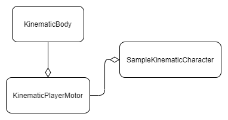
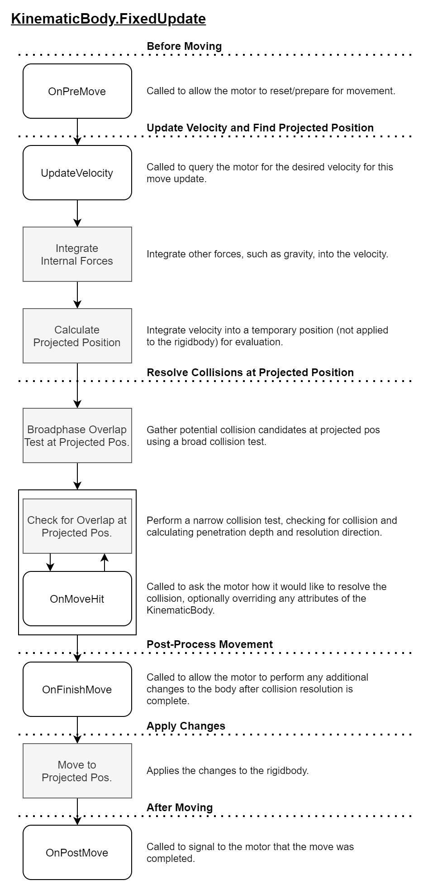

# Kinematic Body

A reference implementation of a KinematicBody intended for use with an upright
box collider that does not rotate.

This package should support any version of **Unity 2019.3** or newer.

> :warning: **WARNING**  
> This package is in an experimental state and has not been extensively
> reviewed or tested.

It is reflective of older games that utilize AABBs for their player volume, such
as the [Source Engine](https://developer.valvesoftware.com/wiki/Dimensions),
which adopts the following convention:

> The Player Hull must have a square footprint (like all the NPC Hulls), i.e. it
> can be as tall as you like, but width & depth must be the same. This is
> because the hull doesn't rotate with the players direction when detecting
> collision with the world.
>
> [Valve Developer Community, Player Entity](https://developer.valvesoftware.com/wiki/Player_Entity)

## Importing this Package

> **NOTE**  
> Support for OpenUPM will come as this library matures with instructor
> and student use.

### Git UPM Dependency

The KinematicBody package can be added as a dependency by adding it as an
entry to the `Packages/manifest.json` file under the `dependencies` array:

```text
    "com.aie-seattle-prog.kinematic-body": "https://github.com/AIE-Seattle-Prog/KinematicBody.git#upm"
```

For more information, review Unity's documentation on [Git dependencies](https://docs.unity3d.com/Manual/upm-git.html).

> **About Git Dependencies**  
> Git must be available on the command-line's PATH variable in order for Unity
> to resolve Git packages. If it is not available on the command-line, the
> package import will fail.

### Embedded Package

You can download a copy of the `upm` branch which contains the bare minimum
necessary files for a UPM package. The contents of this archive should be placed
into its own folder under the Packages folder in your Unity Project.

To verify, the package.json file from this package should be as follows:

```text
Assets/
ProjectSettings/
Packages/
    KinematicBody/
        package.json
        ...
```

## Quick Start

To review an expected setup for the character, review the sample scene under
KinematicBody/Samples/SamplePlayerDemo.unity in the package.

## API

The KinematicBody package provides two key classes and a sample class that
demonstrates how to use it.



The **KinematicBody** contains the bulk of the logic that defines the volume of
the kinematic body and any relevant APIs for querying with it.

It is referenced by the **KinematicPlayerMotor** which implements the
**IKinematicMotor** interface providing implementations for methods that will
be called by the body when it performs its "Move" update.

Users looking for a basic humanoid character can use this library as-is without
modification or much additional work aside from integrating it into their
player prefab and providing the appropriate inputs.

### Manipulating the Motor

The **KinematicPlayerMotor** is referenced by the **SampleKinematicCharacter**
which calls the `KinematicPlayerMotor.MoveInput` method to provide a world-space
input vector which tells the motor which way it should move.

Users should implement their own "Character" script that can provide inputs
with respect to other systems like their camera, current gameplay state, or
other game-specific considerations.

### KinematicBody Move Process

When the KinematicBody moves in Fixed Update, it follows this process:



All of the steps listed in a round white box are callbacks that are called by
the body at the appropriate stage in the process. Steps shown in gray and
rectangular boxes are performed internally by the body and may not necessarily
map 1:1 to a method.

## License

This work is licensed under the MIT License. See [LICENSE.md](LICENSE.md) for details.

Copyright 2021 (c) Academy of Interactive Entertainment
